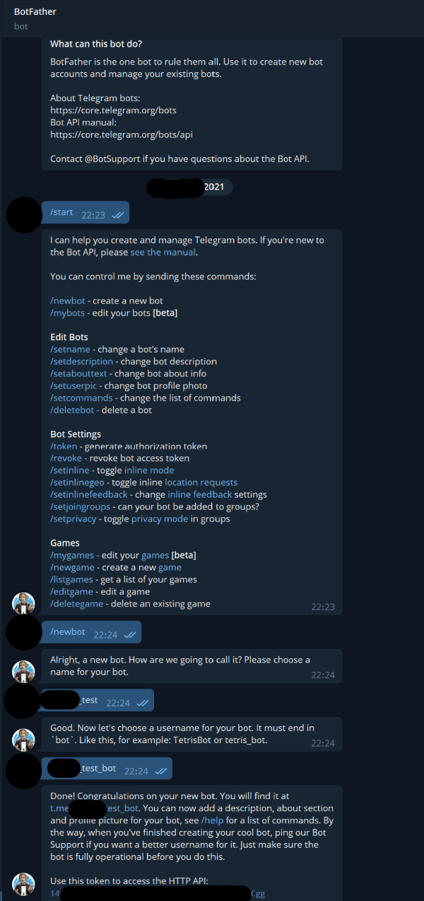
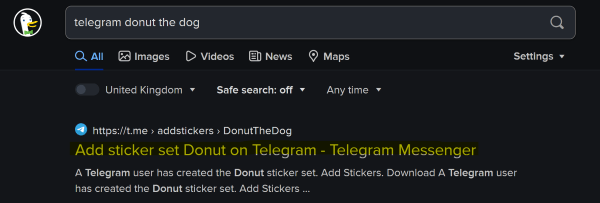
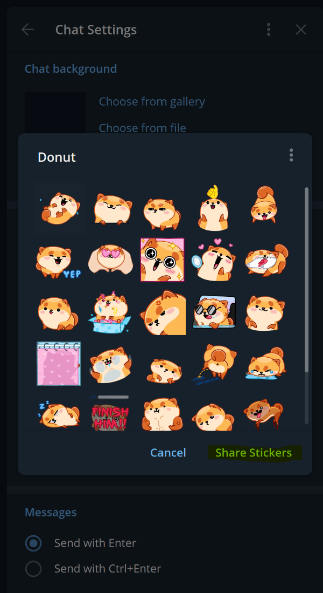

<!-- omit in toc -->
# Tutorial

See below for a step-by-step tutorial on how to use TStickers

- [Step 1 - Send a message to @BotFather](#step-1---send-a-message-to-botfather)
- [Step 2 - Create a file called 'env'](#step-2---create-a-file-called-env)
- [Step 3 - Get the URL of the telegram sticker pack(s)](#step-3---get-the-url-of-the-telegram-sticker-packs)
	- [Option 1 - Use a browser and search for the pack](#option-1---use-a-browser-and-search-for-the-pack)
	- [Option 2 - Use telegram](#option-2---use-telegram)
- [Step 4 - Use TStickers](#step-4---use-tstickers)

## Step 1 - Send a message to @BotFather

1. You must have a telegram account to use this
2. Send a message to @BotFather to get started.
3. Send a message containing `/newbot`
4. Send a message containing the name of the bot e.g. `/test`
5. Send a message containing the username of the bot e.g. `/test_bot`
6. @BotFather will send a message with the token



## Step 2 - Create a file called 'env'

Create a file called 'env' (or env.txt) and paste your token from part 1.

e.g. `env.txt`

```txt
14************
```

## Step 3 - Get the URL of the telegram sticker pack(s)

### Option 1 - Use a browser and search for the pack

1. Use a browser and search for the pack e.g. `telegram donut the dog`

	

2. Click on the link
3. Copy the url: e.g. `https://t.me/addstickers/DonutTheDog`

### Option 2 - Use telegram

1. Open telegram, find the desired sticker pack and share the pack (on mobile pick copy link). An example of sharing a pack is below

	

2. Click on share stickers/ link - this will copy the url: e.g. `https://t.me/addstickers/DonutTheDog`

## Step 4 - Use TStickers

- Run the program `python -m tstickers`
- Enter the URL of the sticker pack
- Get the output in the `downloads` folder.

```bash
$ py -m tstickers
Enter sticker_set url (leave blank to stop): https://t.me/addstickers/DonutTheDog
Enter sticker_set url (leave blank to stop):
============================================================
Starting to scrape "DonutTheDog" ..
Time taken to scrape 28 stickers - 0.933s

------------------------------------------------------------
Starting download of "donutthedog" into downloads/donutthedog
Time taken to download 28 stickers - 0.661s

------------------------------------------------------------
-> Cache miss for DonutTheDog!
Converting stickers "DonutTheDog"...
Time taken to convert 56 stickers (tgs) - 101.442s

Time taken to convert 56 stickers (webp) - 0.671s

Time taken to convert 112/56 stickers (total) - 102.152s

$
```
